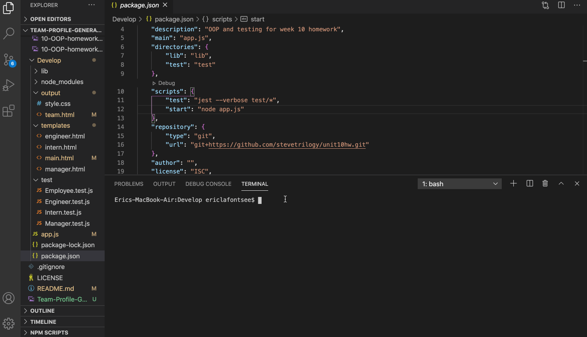

# Team-Profile-Generator

## Description
For this project, I built a Team Profile Generator command-line application. When the application is initiated,  
it will prompt the user to enter information about their team members. There are three types of roles to choose from:  
Manager, Engineer, and Intern. The user can enter as many members as they prefer. Once the user selects the role of the employee, they will be prompted with standard questions followed by specific questions pertaining to that role. Once all  
of the team members have been entered, the application will create an HTML file that displays a team roster. This project  
focused on using the jest module to test the code and using classes.
View a full live demo of this application here: 

## Usage




## Built With
Node.js
JavaScript
BootStrap
HTML
CSS
Font Awesome


## Prerequisites
To build or edit this application, you will need VS Code, or any IDE, as well as node.js installed.

## Installation
* When you first set up the project, open up the integrated terminal in VS Code and navigate to the root directory of your project. If there is not a package.json then input:  
```npm init ```

* A package.json file should appear. Then enter the following into your terminal:  
```npm install inquirer --save ```

* Once all dependencies have been installed, you will need to run your tests. Enter the following in the terminal: 
```npm test```

* To utilize Bootstrap components, grid, and other styles, insert the following link into the head of your html document:

```html
    <link rel="stylesheet" href="https://stackpath.bootstrapcdn.com/bootstrap/4.5.2/css/bootstrap.min.css"
    integrity="sha384-JcKb8q3iqJ61gNV9KGb8thSsNjpSL0n8PARn9HuZOnIxN0hoP+VmmDGMN5t9UJ0Z" crossorigin="anonymous">
```

* To utilize Font Awesome, insert the following link into the head of your html document:

```html
               <link rel="stylesheet" href="https://use.fontawesome.com/releases/v5.8.1/css/all.css"
        integrity="sha384-50oBUHEmvpQ+1lW4y57PTFmhCaXp0ML5d60M1M7uH2+nqUivzIebhndOJK28anvf" crossorigin="anonymous" />

```

## Author
Eric LaFontsee 

## Questions
GitHub - https://github.com/ericlafontsee  
Email - elafontsee@gmail.com

## License
MIT License

## Acknowledgments
Anthony Cooper - For help with debugging the javaScript.

